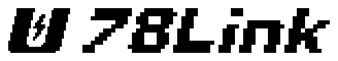

<p align="center"></p>

[简体中文](README.md) | **English**

# 78QuadLink · v0.5.1

**78big's shared-state library and Go toolkit for quadruped simulation.** Move high-frequency joint and IMU data through fixed-layout shared memory, with Go handling model preparation, inspection, on-demand recording, compression, and analysis.

This independent library was extracted from [go1sim](https://github.com/NHK-DOT/go1sim). The core repository contains neither the full Gazebo project nor complete robot models. You can build the SDK, run the Go tools, and analyze recordings without ROS. Full simulation deployment fetches the integration at the exact **Git commit** in [integration.lock.json](integration.lock.json), then verifies SHA-256 equality between the four SDK headers and their integration counterparts.

## Measured performance

Go1/A1 results are from v0.5; Go2 results are from v0.5.1. Each comparison uses the same robot and scene on the same machine, with the GUI disabled and the robot standing. Each run has a 10-second warmup and a 45-second sampling window. CPU totals include all measured process groups and the Go wrapper. **100% CPU means one logical core.**

| Robot | Original 12-channel CPU | Shared motor + IMU CPU | CPU reduction | RSS reduction | Real-time factor |
|---|---:|---:|---:|---:|---:|
| Unitree A1, mean of two runs | 98.93% | 41.96% | **57.6%** | 20.4 MiB | 1.0 |
| Unitree Go1, one run | 100.11% | 43.58% | **56.5%** | 22.1 MiB | 1.0 |
| Unitree Go2, mean of two runs | 96.19% | 39.57% | **58.9%** | 21.4 MiB | 1.0 |

[Go1/A1 measurements](docs/v05_measurements.json) · [Go2 measurements](docs/go2_measurements.json) · [v0.5 validation](docs/v05_release.md) · [Historical performance](docs/v043_performance.md) · [Existing approaches](docs/quadruped_optimization_landscape.md)

**Go2 validation in v0.5.1:** the initial adaptation inherited simulation joint gains that were too high for the Go2 model. Dedicated gains fixed the instability without changing model inertia, torque limits, or the simulation timestep. Both original and shared paths passed 30 seconds of continuous walking followed by a return to standing. Timestamp comparisons matched 64,610 IMU samples and 6,585 TF observations, with no mismatches. See the [fix and evidence](docs/go2_tuning_v051.md).

A1 uses the official Unitree model and A1 kinematics. Its ROS 1 interfaces are adapted before startup while preserving physical parameters. A1 checks matched 43,215 IMU samples and 4,386 TF observations with no mismatches. Go1 and A1 passed short stand–trot–stand checks, moving approximately 0.83 m and 0.82 m respectively.

These are short, scene-specific simulation results. They do not establish long-term rough-terrain stability, real-hardware compatibility, or proportional improvements in control latency, training speed, or power consumption.

The historical move from 12 channels to aggregated DDS reduced CPU for the measured main processes from 93.81% to 51.74% (44.8%). Its measurement scope differs from the current results, so the percentages must not be added. Shared memory and frame aggregation are established techniques; this project's contribution is optional integration, practical tools, and reproducible measurements.

## One-command deployment

Validated full-simulation environment: **Ubuntu 22.04 / ROS 2 Humble / Gazebo Classic / Linux amd64**. Initial deployment requires network access. Missing system dependencies are installed through `sudo`; existing dependencies are reused.

```bash
git clone --branch v0.5.1 --depth 1 https://github.com/NHK-DOT/78QuadLink.git
cd 78QuadLink
./deploy.sh
~/.local/bin/quadlink78 go2 --gui
# Also supported:
# ~/.local/bin/quadlink78 a1 --gui
# ~/.local/bin/quadlink78 go1 --gui
```

Press `2` to stand, `4` to trot, and `W/S/A/D` to adjust velocity; press `2` to return to standing. Omit `--gui` for headless operation. The default path uses shared motor and IMU data. Use `--dds` for aggregated DDS or `--legacy` for the original 12-channel path. Set build parallelism with `./deploy.sh --jobs 4`.

For SDK and Go tools only:

```bash
./deploy.sh --tools-only
~/.local/bin/quadlink78 version
./artifacts/bin/simkit doctor \
  -adapter tools/simkit/adapters/a1-gazebo-classic.json \
  -backend ./artifacts/bin/go1relay
```

Tools-only installation requires Go >= 1.18, CMake, and a C++17 compiler, but no ROS. The SDK is installed under `artifacts/sdk`. The launcher is a symlink: keep the source directory and rerun deployment after moving it. To uninstall, remove `~/.local/bin/quadlink78` and the project directory. System ROS/Gazebo dependencies are not automatically uninstalled.

## Use as a library

```cmake
find_package(quadlink78 0.5 CONFIG REQUIRED)
target_link_libraries(my_adapter PRIVATE quadlink78::board)
```

Configure your project with `-DCMAKE_PREFIX_PATH=/path/to/78QuadLink/artifacts/sdk`.
The [cross-process example](examples/board_roundtrip.cpp) runs without ROS:

```bash
cmake -S . -B build
cmake --build build
ctest --test-dir build --output-on-failure
```

The [shared-memory design](docs/library.md) describes partitions, atomic snapshots, writer locks, and protocol boundaries. The SDK is a header-only C++17 library. The Go CLI consists of independent modules using the standard library; a stable importable Go package API is not yet provided.

## What Go does

- **Before startup:** parse A1/Go2 URDFs, validate joint mappings and limits, resolve model assets, and generate ROS 2 descriptions and SHA-256 contracts.
- **During a run:** create the shared board for the selected profile, launch processes, hand over the terminal, forward signals, and clean up on exit. It does not relay every motor frame in shared mode.
- **On demand:** inspect read-only snapshots, record compressed samples, verify archive integrity, and perform streaming analysis without ROS or a running simulation.
- **Optional legacy backend:** retain Unix-domain-socket registration, leases, and forwarding. Shared mode does not require a resident relay.

Historical recorder measurements were approximately 2.0–2.3% of one CPU core and 8.3 MiB RSS, with archives approximately 58.4% smaller. Compression is used for recording, outside the real-time motor path. Recording samples the latest state and may skip updates; it is not a lossless rosbag replacement.

[Go toolkit documentation](tools/simkit/README.md) · [Backend documentation](tools/go_relay/README.md)

## Compatibility and layout

The current adaptation scope is **Unitree quadrupeds**, with **Go1, A1, and Go2 tested**. B2, other brands, MuJoCo, and Isaac have not been validated with this plugin. The shared board itself is robot-independent, but the supplied motor schema has exactly 12 joints. An adapter JSON file cannot replace actual simulator/controller read and write interfaces.

ROS 2 continues to provide other topics, TF, and integration. This is not MQTT or a CAN bus, and shared memory still incurs data-access costs.

| Directory | Contents |
|---|---|
| `include/quadlink78` | Shared board and frame headers without ROS dependencies |
| `tools/simkit` | Go lifecycle tools, model contracts, archive analysis, and robot profiles |
| `tools/go_relay` | Board initialization, inspection, recording, and optional UDS relay |
| `external/go1sim` | Pinned integration fetched during deployment; ignored by Git |
| `testdata` | Official A1/Go2 URDF fixtures and original license |
| `assets` | White-backed PNG wordmark and 16/32/48 px ICO symbol |
| `docs` | ABI documentation, measurements, comparisons, and sources |

C++ remains responsible for Gazebo/ros2_control interfaces and the control algorithms. Shared odometry did not demonstrate an additional performance benefit and is disabled by default. Normal ROS TF consumers remain supported. Detailed historical reports are currently in Chinese; measurement files are structured JSON.

## Releases and licensing

The [v0.5.1 release](https://github.com/NHK-DOT/78QuadLink/releases/tag/v0.5.1) provides core source, a Linux amd64 toolkit, an ICO icon, and SHA256SUMS. Full simulation deployment fetches pinned integration sources and system dependencies; the toolkit is not an offline ROS installer. The updated PNG wordmark and bilingual READMEs are available on the current branch.

Project code uses [BSD-3-Clause](LICENSE). Third-party fixtures and external integration retain their original licenses; see [THIRD_PARTY.md](THIRD_PARTY.md). The pixel U silhouette references Unitree's website icon, with a lightning addition and “78Link” lettering. Unitree trademarks remain with their owner; this is not official Unitree software.
